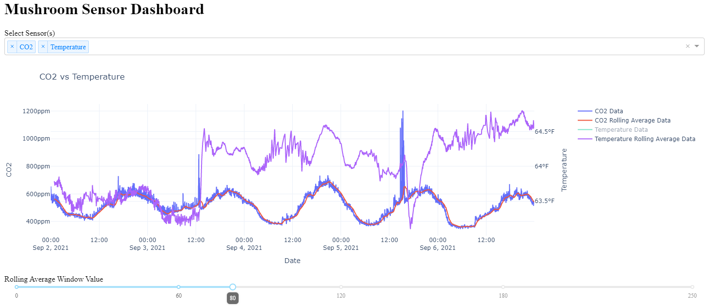

# Mushroom-Dashboard
Application for visualizing mushroom environmental sensor data.

<kbd>
  
</kbd>

Steps for running:
* Launch jupyter-lab
* Install dependencies in requirements.txt
* Run Mushroom.ipynb
  * Select sensors from dropdown
  * Modify rolling average range with slider
  * Select and de-select items on legend
  * Hover over data to display the value

Plotting created primarily with [Dash Plotly](https://github.com/plotly/dash)
